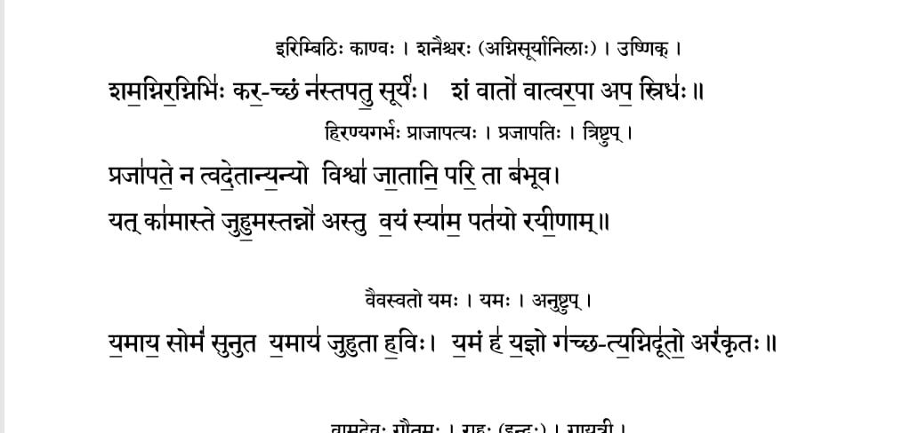

उदात
स्वरित
अनुदाता

ऋग्वेद - ऋषि, देवता, छन्दस् 

#
इतिम्वठि: काण्व: । शनैश्चर: (अग्निसूर्यानिला:) । उष्णिक् ।

    शम॒ग्निर॒ग्निभिः कर॒-च्छं न॑स्तपतु॒ सूर्यः । शं वातो॑ वात्वर॒पा अप॒ स्रिध॑: ॥ 

हिरण्यगर्भः प्राजापत्य: । प्रजापति: । त्रिष्टुप् ।

    प्रजा॒पते॒ न त्वदे॒तान्यन्यो॒यो विश्वा॑ जा॒तानि॒ परि॒ता ब॑भूव ।
    यत् का॑मास्ते जुहु॒मस्तन्नो॑ अस्तु व॒यं स्या॑म॒ पत॑यो रयी॒णाम् ॥

वैवस्वतो यमः ।यमः ।अनुष्टुप् ।

    य॒माय॒ सोमं॑ सुनुत य॒माय॑ जुहुता ह॒वि: । य॒मं ह॑ य॒ज्ञो ग॑च्छ-त्य॒ग्निदू॑तो॒ अरं॑कृत: ॥

#
    शम् अग्निः अग्निभिः करच्छन् नः तपतु सूर्यः ।
    
* शम् = कल्याणम्
* अग्निः = (१/१, Agni)
* अग्निभिः (३/३, by the agni) 
* करच्छन् = (१/१, held/covered in the hand)
* नः = (~~२/३~~, ४/३, ~~६/३~~ - for us) 
* सूर्यः = (१/१, सूर्य)
* तपतु = लोट् लकार 

अन्वयः - करच्छन् शम् अग्निः अग्निभिः । सूर्यः नः तपतु 

# 
    शं वातो वात्वरपा अप स्रिधः ।

* शम् = auspeciousness
* वातः = wind
* वातु = लोट् - may blows away
* अरपा = harm
* अपः = water
* स्रिधः = From root √स्रि (to flow) - that washes away

# 
    प्रजापते न त्वदेतान्यन्यो विश्वा जातानि परि ता बभूव

